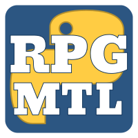

#  RPGMTL  
  
Flexible Tool written in Python to create Translation Patches for games.  
The interface runs in your Web Browser.  
  
The list of supported files is currently:  
- JSON (for RPG Maker MV, MZ and other games)  
- Javascript (for RPG Maker MV, MZ and other games)  
- CSV (for RPG Maker MV, MZ and other games)  
- INI (for RPG Maker MV, MZ and other games)  
- TXT (i.e. regular text files)  
- Ruby Marshal (.rxdata, .rvdata, .rvdata2 for RPG Maker XP to VX Ace)  
- RGSSAD Archives (.rgssad, .rgss2a, .rgss3a for RPG Maker XP to VX Ace)  
- RPY files (for Renpy Scripts)  
- MED (md_scr.med archives, used by Triangle and Lusterise games)  
- YPF Archives and YBN Scripts (YU-RIS Engine)  
- KiriKiri Engine scripts (.ks and .tjs)  
- NScripter scripts (see the [dedicated readme](https://github.com/MizaGBF/RPGMTL/blob/main/readme/plugins/nscripter.md) for details)  
- Subtitles (.lrc, .ssa/.ass, .srt)  
  
More will be added as I see fit.  
  
  
*All screenshots are from version 3.27.*
  
## Table of contents  
  
* [Introduction](#introduction)  
* [Installation](#installation)  
* [Usage](#usage)  
* [Project Management](#project-management)  
* [Translation](#translation)  
* [Advanced Usage](#advanced-usage)  
  
> [!NOTE]  
> Looking for more informations? Check the [readme folder](https://github.com/MizaGBF/RPGMTL/tree/main/readme).  
  
## Introduction  
  
RPGMTL is a tool, written in Python, allowing you to extract, translate and patch strings from your Games.  
It works via a small web server, and the UI uses your own web browser.  
It's lightweight and is designed to let you iterate over new game updates, to keep your patches up to date.  
  
RPGMTL allows multiple people to work at the same time on the same project.  
Some operations are blocking on purpose (for example, during string extraction), in case multiple users are working at the same time.  
  
## Installation  
  
### Install Python  
  
You need a system supporting [Python 3.13 or higher](https://www.python.org/downloads/).  
Make sure to have it installed.  
An older version might work, but isn't supported.  
  
### Install RPGMTL  
  
Grab a copy of this repository.  
**For the latest version:**  
*(It might be unstable, contains experimental features or unfinished features)*  
Either git clone:
```console
git clone git@github.com:MizaGBF/RPGMTL.git
```  
or use the **Green** Code button on top and download as ZIP (Don't forget to unzip).  
  
**For older and stable versions:**  
Go under the [Release](https://github.com/MizaGBF/RPGMTL/releases) tab.  
  
### Install Requirements  
  
Install the [requirements](https://github.com/MizaGBF/RPGMTL/blob/master/requirements.txt).  
Run the following command, in the same folder:  
```console
python -m pip install -r requirements.txt
```  
On Windows, if you don't know how to do it, you can `SHIFT+Right Click` in the folder and select `Open in Terminal`/`Open PowerShell window here`/`Open Command prompt here`.  
  
Additionally, if Python isn't in your `PATH`, replace `python` with the full path to its executable (for example `C:\python3\python.exe -m pip install -r requirements.txt`).  
  
**If you don't wish to install all the requirements:**  
[aiohttp](https://github.com/aio-libs/aiohttp) is required for RPGMTL to function.  
```console
python -m pip install -U aiohttp
```  
  
[Deep Translator](https://github.com/nidhaloff/deep-translator) is required for the Google Translator plugin to function.  
```console
python -m pip install -U deep-translator
```  
  
[Google Gen AI SDK](https://github.com/googleapis/python-genai) is required for the Gemini Translator plugin to function.   
```console
python -m pip install -U google-genai
```  
  
### Update  
  
Simply repeat the installation process.  
Make sure to keep `settings.json` file and your `projects` folder.  
If a plugin's implementation changed, you might need to Extract the strings again in your project.  
  
## Usage  
  
### Quickstart
  
Simply run `rpgmtl.py` to start a small web server.  
Either in a terminal:  
```console
python rpgmtl.py
```  
  
Or, on Windows, by double clicking the file and starting it with Python.  
(Don't try to start it with the Python Launcher, the one with a rocket icon, it won't work. Make sure it's python.exe. Do `Right Click` and `Open with...` to go select it, if needed.)  
  
Then you can access it with your favorite web browser.  
`http://localhost:8000/` should be the default address. [Direct Link](http://localhost:8000/).  
  
**To stop it**, use the *Shutdown* button on the top left of the Home Page, or press `CTRL+C` on the server console.  
An Autosave is ran on shutdown, and also every 5 minutes otherwise.  
  
> [!WARNING]  
> Don't close the console to shut it down! The abrupt stop might result in data losses or corruption.  
  
> [!NOTE]  
> Copy buttons will likely not work if you access RPGMTL via an IP (for example, `127.0.0.1:8000`) hence why localhost is prefered. If you are on a different machine, you could try to set a domain name for that machine IP in your OS host file to fix this issue.  
  
### Settings
  
Before starting anything, you can tinker with the various settings.  
Global settings will affect every projects.  
They can be overrided individually for each project, if needed.  
  

  
### Keyboard shortcuts
  
RPGMTL is entirely usable without mouse:  
- `Tab`, `Shift+Tab`, `Arrow`, `Page Up`, `Page Down`, `Home` and `End` keys to navigate around. `Tab` works even if you're focused on a text input.  
- `F1` key to open and close the help, when available.  
- `Escape` key to use top left button (Either Back or Shutdown) and to close the help if open.  
- `Enter` key lets you interact with the highlighted element or validate a text input.  
  
In the file page:  
- `Ctrl+Space` to go the next enabled untranslated string.  
- `Ctrl+Shift+Space` to go the next untranslated string.  
- `Ctrl+H` to go back to the home page, if available.  
- `Ctrl+P` to go back to the project page, if available.  
- `Ctrl+R` to reload the page, if available.  
- `Ctrl+M` to move and slide the original and translated string areas.  
- `Ctrl+B` to cycle the selected string marker color. Markers are at the global level.  
- `Ctrl+O` to copy the selected string original version.  
- `Ctrl+I` to copy the selected string translated version.  
- `Ctrl+U` to unlink/link back the string from/to its global translation.  
- `Ctrl+Y` to ignore the string.  
- `Ctrl+Shift+Y` to ignore all the occurences of this string.  
- `Ctrl+Alt+Y` to ignore all the occurences of this project.  
- `Ctrl+Left/Right` to go to the previous/next file, if available.  
- `Ctrl+E` to focus the edit area, if open.  
  
When the edit area is open:  
- `Escape` key to unfocus the edit area, if focused.  
- `Ctrl+S` to confirm and save the translation.  
- `Ctrl+Q` to cancel and close the edit area.  
- `Ctrl+K` to translate the original string.  
- `Ctrl+L` to search the original string.  
- `Ctrl+O` to copy the original string, if focused.  
- `Ctrl+D` to delete the translation.  
  
Some shortcuts have alternatives. Click the Help button for a reminder.
  
### Port
  
You can change the port used by RPGMTL with the `-p/--port` parameter:   
```console
python rpgmtl.py --port 60000
```  
  
### HTTPS
  
The project is intended to be used on a local network.  
If you wish to access it remotely, it's **recommended** to enable HTTPS.  
You'll need to have a valid certificate and key.  
Place them in the folder and run **once**:  
```console
python rpgmtl.py --https name_of_your_key_file name_of_your_password_file
```  
If everything goes well, `SSL is enabled` should appear in the log.  
The certificate and key locations will be saved for the next use.  
  
If you wish to revert this setting, run **once**:  
```console
python rpgmtl.py --http
```  
RPGMTL will *forget* these file locations.  
  
### IP Filter  
  
This is another **recommended** feature if you wish to access it remotely.  
If you wish to filter which IP can access the server, create a `whitelist.txt` file near `rpgmtl.py`.  
Add the allowed IP inside, one by line.  
It supports both IP v4 and v6.  
  
Then to enable the filter, run **once**:  
```console
python rpgmtl.py --ip on
```  
  
To disable it at some point in time:  
```console
python rpgmtl.py --ip off
```  
Run `python rpgmtl.py --help` for alternative options.  
  
### Disable a Plugin  
  
To disable a plugin and stops it from loading, you can create a file named `disabled.txt` in the same folder as `rpgmtl.py`, with the name of the plugin files you which to ignore, one per line.  
For example:  
```
json
rm_marshal
```  
will disable both those plugins.  
  
## Project Management  
  
### Creation  
  
On the Home Page, click on `New Project`.  
Select the location of the game you wish to translate.  
  

  
You'll then be asked a project name. This name will be the one used for the project folder and in the Web UI.
Once done, hit `Create`. The game files will be copied for later use and backup purpose.  
  
> [!NOTE]  
> Your Project files are located in the **projects** folder.  
  
> [!IMPORTANT]  
> The game you wish to translate must be on the same machine as RPGMTL.  
  
You can then modify your **Project Settings** and then **Extract the Strings**.  
  

  
### Project Structure  
  
If you go into the `projects` folder and into your project folder, you'll see:  
* `edit`: This is where you can add additional files to put in the final patches. Such as translated images, etc... The inside must mirror the game folder structure.  
* `originals`: This is where RPGMTL keeps a copy of the targeted game files. Although it's recommended to keep a clean copy of your game, you'll find original files here, if needed.  
* `release`: This folder only appears upon using the `Release a Patch` button. Your translated files will appear inside, and only the translated ones. Unaltered and ignored ones won't be copied inside.  
* `config.json`: A file containing various infos about your project.  
* `strings.json`: A file containing the game strings and translations. Backups are created when doing various operations (such as extracting) but nothing less. Feel free to do manual backups if you wish.  
  
More files and folders might appear.  
For a general use, you only need to care about the `edit` and `release` folders.  
  
### Deletion  
  
* Make sure RPGMTL isn't running.  
* Go into the `projects` folder and delete the project you wish to remove.  
  
## Translation  
  
### Browsing Game Files  
  
On your project page, click on `Browse Files`.  
  
  
  
Here you'll be able to go through the detected files.  
You can set a file to be **ignored** by pressing `CTRL+Left Click` on it. It'll then appear **red**.  
A file with no remaining strings to translate will appear **green**.  
Some RPG Maker MV/MZ files are set to be ignored by default.  
  
Additionally, folders containing virtual files will appear with a light grey background.  
  
### Modifying Strings  
  
Click on a file to open the list of strings found inside.  
Strings are listed in groups, and the group name, if it exists, is show on the top left. It's mostly here for context and as a visual aid.  

  
The list shows, on the left, original strings and, on the right, translations.  
You can click on one to open the editing box.  
All occurences of a string are, by default, linked. So, **if you translate a string**, all occurence of that string will have this translation.  
You can **change** this behavior by pressing `Shift+Left Click` on a string you wish to unlink. Its box will become green.
You can also set a string to be ignored, as for files, by pressing `CTRL+Left Click`. It'll be skipped during the patching process.  
Finally, to delete a translation, click on it and on the *Trashbin* button.  
  
Click the help button on the top right corner for more shortcuts and details.  
  
> [!NOTE]  
> By default, the little golden/yellow mark appearing on the left of a string line means the string has been modified or added in a previous string extraction.  
> This marker can also be used by plugins however, such as the Character Limit one.  
  
> [!IMPORTANT]  
> If you're using multiple tabs or multiple people are working on the same RPGMTL instance, it's not recommended to work on the same file at once.  
> The string list is only updated when you make a change to it or click the refresh button. So you might not see another change right away.  
  
### Machine Translation  
  
When modifying a string, you have the option to get a machine translation using the yellow *Translate* button.  
Doing so will put the translation in the editing area, for you to modify.  

If you wish to translate a whole file, use the dedicated button on top of the string list.  
Be aware rate limits and the like might cause you issues if you plan to translate a lot of files this way in a short time span.  
Please refer to [plugins.md](https://github.com/MizaGBF/RPGMTL/blob/main/readme/plugins.md) if you wish to extend RPGMTL capabilities in that regard.  
  
## Advanced Usage  
  
> [!NOTE]  
> If you're looking for informations on Plugins development or a specific Plugin, check the [readme folder](https://github.com/MizaGBF/RPGMTL/tree/main/readme).  
  
### Game Updates  
If you're translating a recently released game, you can easily update your project to the latest version.  
Click on `Update the Game Files` and select where this new version is. Fresh files will be fetched.  
You can then click on `Extract the Strings` to update the string list.  
A backup of `strings.json` will be created beforehand, just in case (be aware it exists).  
  
When browsing your updated string list, you might spot some with a yellow rectangle on the left: It indicates which strings got added in this new version.  
  
### Custom Patches  
  
> [!NOTE]  
> They're called Fix in RPGMTL.  
  
Custom Patches are used to automate the patching of the some part of the game.  
This can be done via the `Add a Fix` menu.  
Inside, you can set small Python code snippets, which will run during the patching process (after everything else, to be exact).  
  
To do so, create one and set what filename this code targets. For example, to target all the RPG Maker MV/MZ map files, you can set `data/Map`. Or to target a specific file, set its whole path (for example `data/Map001.json`).  
For files contained into archives, you merely need to match the archive name.  
  
In the `Fix Code` text box, you can put the Python code to run.  
You have access to a variable called `helper` to help you with your modifications.  
It includes the following:  
* A `content` bytes attribute: It's the patched file, as bytes, and what you must modify.  
* A `modified` bool attribute: Set it to True if you modified the file `content`.
* `from_str` method to get a String version of the `content`. `to_str` allow you to convert it back and set it inside `content`.  
* `from_json` and `to_json` do the same, with JSON content.  
  
Example, to edit a RPG Maker MV/MZ System.json locale:  
File match is:  
```  
data/System.json
```  
Code is:  
```python
d = helper.to_json() # get the content as json
d["locale"] = "en_UK" # modify the locale
helper.from_json(d, separators=(',',':')) # convert it back to bytes
helper.modified = True # raise modified flag to True
```  
  
The complexity will grow for other file formats.  
The `PatcherHelper` is defined at the start of `rpgmtl.py`, if you wish to take a closer look at it.  
  
> [!IMPORTANT]  
> Be careful of downloading and running a translation project made by someone else, as running the Custom Patches can technically execute anything.  
> Make sure to at least check the list of patches first.  
  
### Import Strings from RPGMTL  
This button allows you to import `strings.json` and `strings.py` files from older RPGMTL versions.  
Custom patches won't be imported, as they relied on different codes.  
Be aware it's a convenience feature and far from perfect.  
  
### Import Strings from RPGMakerTrans v3
This button allows you to import content from RPGMaker Trans Patch files.  
Select the location of a `RPGMKTRANSPATCH` file, and it will read the content of the patch folder.  
If the RM Marshal plugin is present, the `rm_marshal_multiline` setting of the project will be used to decide how to split the strings with new lines or not.  
For the best results, you might want it to be **enabled**.  
Be aware it's a convenience feature and far from perfect.  
  